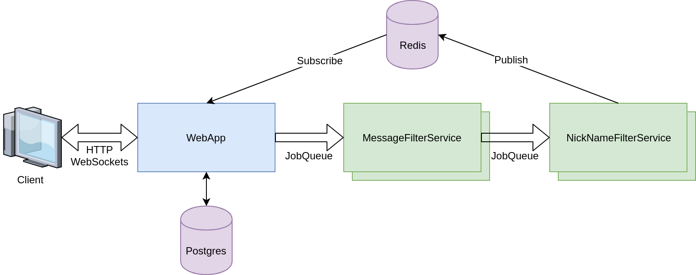

# SimpleMicroservice App

This is a `docker-compose` based project to demonstrate a very basic microservice architecture.

## Services



### WebApp

This is the basic `WebApp` which acts as a frontend for the demonstration.

It is a simple real-time chat client. The user can pick a `nickname` and send a `message` to the chatroom.

The `WebApp` is receiving new messages in the chatroom via `Websockets`.

If a new `message` is posted, the `WebApp` emits a `filter-message` event on the JobQueue with this example payload:
```
{ "message": "Some message", "nickname": "Some Nickname" }
```

After accepting a `Websocket` connection, the `WebApp` it starts to listens for updates on the `chatroom` channel via `Redis`.

### MessageFilterService

This is a simple backend service which filters all chat messages. If some bad words have been found, they are replaced with '***'.

The `MessageFilterService` is waiting for the `filter-message` event on the JobQueue. Afterwards the received payload is updated and an `filter-nickname` event emitted.

### NicknameFilterService

Just like the `MessageFilterService` the `NicknameFilterService` is a backend service waiting for jobs.

After receiving a `filter-nickname` event, it inspects the `nickname` and replaces all bad words with '***'. Afterwards the `NicknameFilterService` is broadcasting the filtered JSON-Object in the `chatroom` channel via `Redis`.

### Redis

This is the Publish-Subscribe-Backend used by the `WebApp`, `MessageFilterService` and `NicknameFilterService`.

### Postgres

This is the PostgreSQL Server used by `WebApp`, `MessageFilterService` and `NicknameFilterService` to forward jobs via a `Job Queue`.

## Running the example

The whole application stack can be started with:

```
$ docker-compose up
```

This will build the docker-containes and bring them up as needed. The application can then be stopped with `CTRL+C`.
