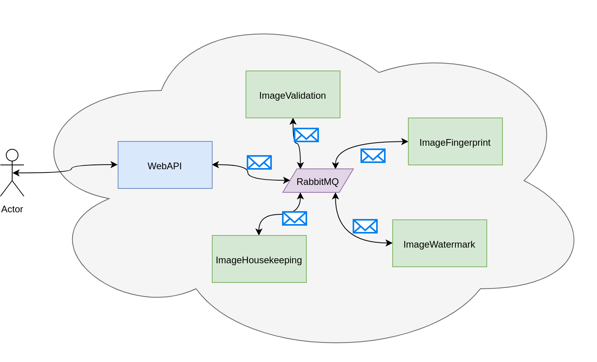

# Nodejs Microservice Example

## Overview



## Running

The whole setup consists of four individual Microservices, a WebAPI and a RabbitMQ instance. All of these programs are run in seperated Docker containers. For easier orchestration the whole setup is described in the `docker-compose.yml`.

In order to start the whole setup just run `docker-compose up`.

After the container have been built and started, you can access the WebApi via `http://localhot:3000`. Hitting `ctrl+c` will shutdown the docker-compose setup again.

In order to remove the containers you need to run `docker-compose down`. If you additionally want to delete all uploaded files, use `docker-compose down -v`.

From a different terminal (but from the project root) you can run `docker-compose ps` to see, which containers are running and on which ports they listen.

## Microservices

### WebAPI

This is a small Express app to provide an HTTP-Frontend to interact with the microservice infrastructure.

When uploading one (or multiple) images via `/images/upload` the app publishes a message to the `ImageUploaded` queue for every upload image.

You can easily upload a image via curl:
```
curl -F 'firstImage=@/some/file.jpg' http://localhost:3000/images/upload
```

For multiple uploads just repeat the `-F` option with different param names:
```
curl -F 'firstImage=@/some/file1.jpg' -F 'secondImage=@/some/file2.jpg' http://localhost:3000/images/upload
```

### ImageValidation

This service has the job to check if the uploaded file is actually a image. Therefore it uses ImageMagick.

If the image is valid, the service publishes a message to the `ImageFingerprint` queue, the message will then be picked up by the Fingerprint-Service.

### ImageFingerprint

This service creates a fingerprint of the image. In this example it only creates the SHA256 sum of the bytes. In a real world scenario it could generate a more intelligent fingerprint of the image itself to find identical/similar pictures to prevent storing the same images again.

After creating the fingerprint, this service emits a message to the `ImageWatermark` queue to inform the Watermark-Service that he can take over.

### ImageWatermark

This service add a watermark in the lower right corner of the image. Afterwards it emits a message to the `ImageReady` queue.

### ImageHousekeeping

This service is responsible for moving/cleaning up the uploaded images. For images that were process successfull, the service moves the image from the `in-flight` folder into the `done` folder.

For images that failed, this service removes the already stored image file from the system.

## Infrastructure

### RabbitMQ

RabbitMQ is providing the message queue to transport messages between the services. Services can listen on different queue in order to receive messages. Other service can publish messages to these queues.

This approach decouples the services from each other and enables scalability. It is possible to have a single service publishing a lot of messages while multiple instances of a differente service receive these message and process them in parallel.

RabbitMQ provides a management plugin with a web frontent for a better visualization of what is going on. Running the whole docker-compose setup makes the plugin available under:

* Management Plugin: http://localhost:15672
* Username: `guest` 
* Password: `guest`