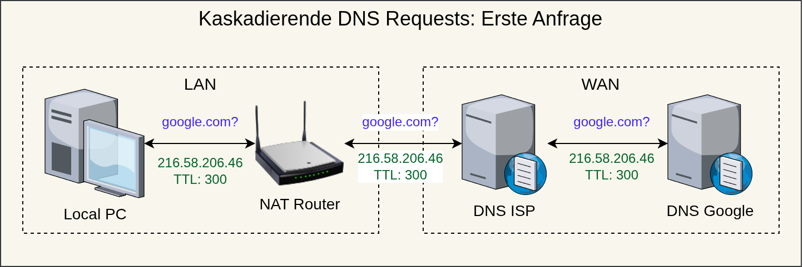
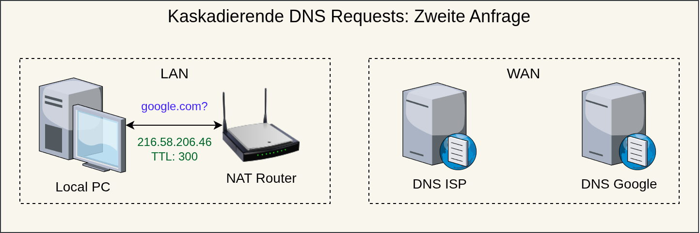
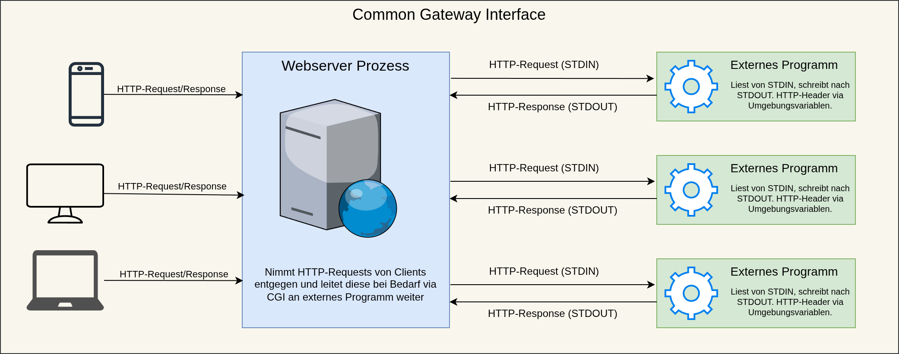
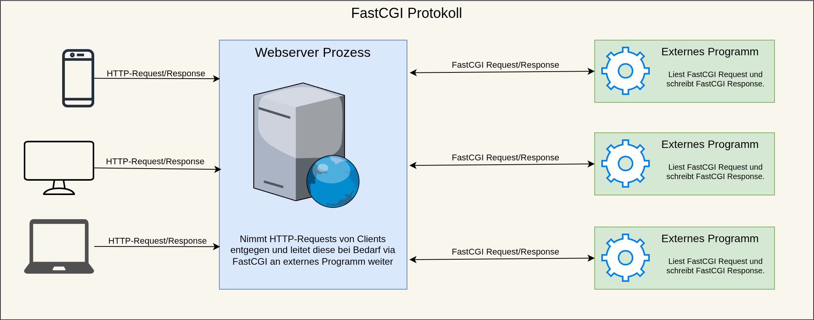
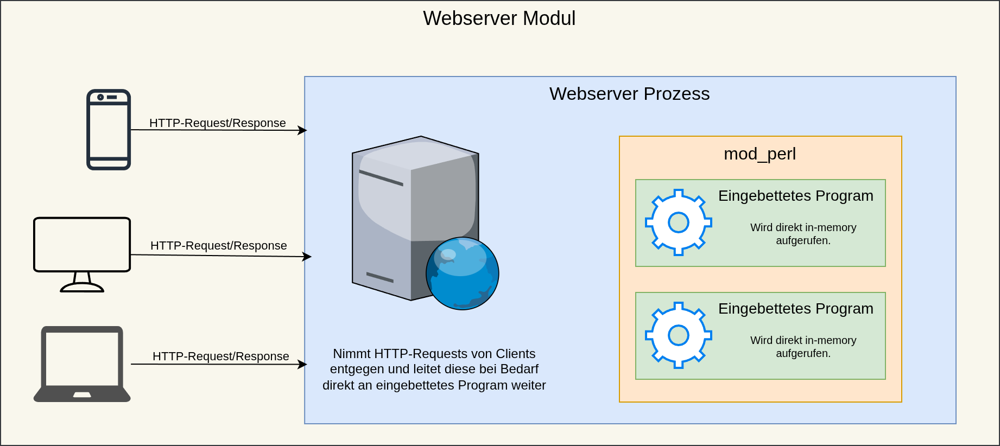
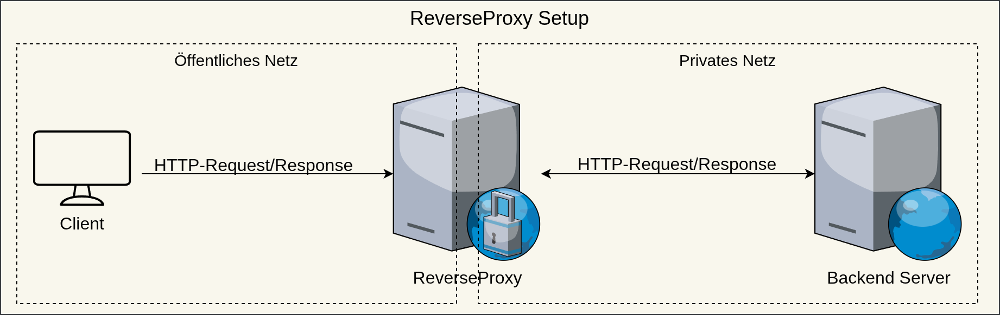
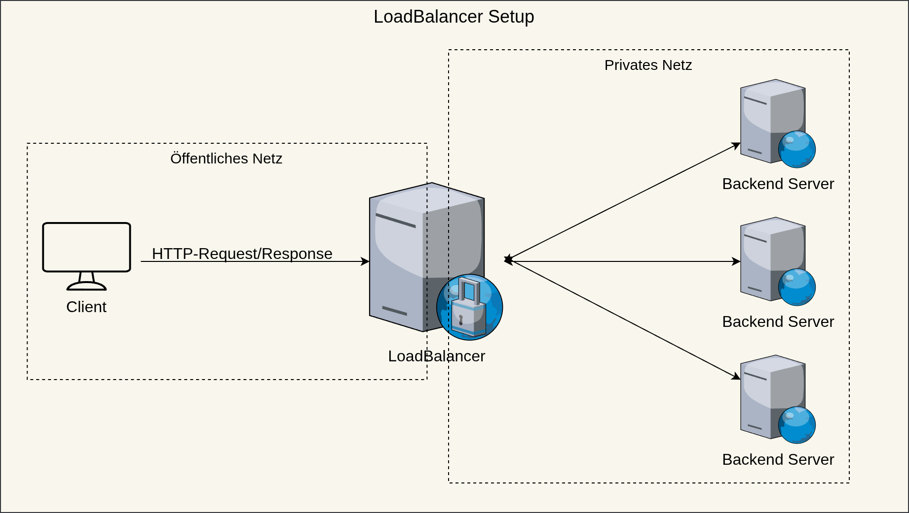
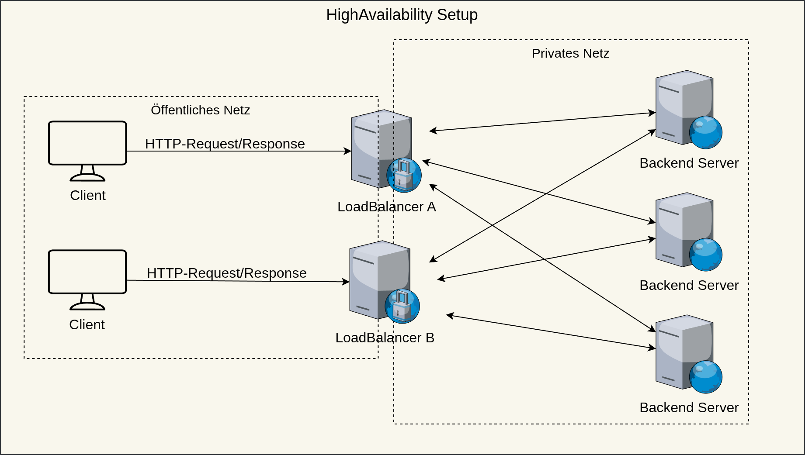

<!-- _class: lead -->

# Deployment von WebAnwendungen
## Web Anwendungen 2
## Sven Eppler


---

<!-- _class: chapter -->

# Web Deployment
## Von `127.0.0.1` ins WorldWideWeb

---

# Web Deployment

- Unter dem Begriff _Deployment_ versteht man das Ausrollen/Ausliefern einer WebSite/WebAnwendung
- Dazu muss die Anwendung auf einen Server hochgeladen werden
- Dieser muss für die Zielgruppe über das Internet erreichbar sein
- Des weiteren wird i.d.R. eine Domain für das Projekt gebucht/genutzt

---

# Vorwissen: IPv4/IPv6, TCP/IP

- Jeder Rechner der am Internet teilnehmen möchte, muss über eine IP Adresse verfügen
- Es gibt öffentliche und private IP-Bereiche
  - Private Adressblöcke: 192.168.0.0/16, 172.16.0.0/12, 10.0.0.0/8, fd00::/8
  - Local Only Addressblock: 127.0.0.0/8, ::1
  - Public: Alles andere
  - Private Adressen werden von **keinem** Router in ein öffentliches Netz geroutet!
- Serverdienste können also nur mit einer öffentlich erreichbaren IPv4/6 Adresse angeboten werden.

---

# Vorwissen: DNS

- Das "Domain Name System" ist verantwortlich dafür, für Menschen lesbare "Hostnames" in IP-Adressen zu übersetzen
  - Vergleich: Telefonbuch
- Wichtig: Dem Internet (konkret TCP/IP & UDP) sind Hostnames vollkommen egal, beide Protokolle transportieren **keinerlei** Hostnames/Domains!
- D.H.: Immer wenn im Browser eine Domain aufgerufen wird (manuell, via Link, fetch-api, etc.) muss der Browser mittles DNS Request die passende IP zur Domain ermitteln
- Erst mit der IP-Adresse wird eine TCP/IP Verbindung aufgebaut
- Danach folgt dann erst der HTTP-Protokol-Traffic

---

# Vorwissen: DNS

- DNS definiert sog. "Records"
  - A-Record: IPv4 Adresse
  - AAAA-Record: IPv6 Adresse
  - CNAME-Record: "Pointer" auf anderen Hostname
  - TXT-Record: Freitext Records um Daten zu hinterlegen
  - MX-Record: Welcher Mailserver verantwortlich ist
- Abfragen eines DNS:
  - Linux: `dig` oder `host`
  - Windows: `nslookup`

---

# Vorwissen: DNS

- DNS ist "kaskadiert" aufgebaut
  - Für jede Domain gibt es i.d.R. einen "autoritativen" Nameserver
    - Dieser ist die single-source of truth
  - Die meisten Nameserver sind "rekursiv", d.H. sie leiten die Anfrage weiter, wenn sie selbst keine Antwort haben
    - Beispiele: ISPs, Fritz.Box, Google/Cloudflare
  - Jeder Record hat eine TimeToLive (TTL), die definiert, wie lange ein rekusriver Nameserver die Antwort zwischenspeichern darf
    - So wird verhindert, dass jeder Lookup immer an den autoritativen Nameserver geht
    - Caching von DNS Responses ein wichtiger Faktor bei WebDeployments!
---

# Vorwissen: DNS



Der Erste Request muss im Zweifel bis zum autoritativen Nameserver durchgereicht werden. Jeder Nameserver auf dem Weg darf die Antwort aber speichern.

---

# Vorwissen: DNS



Erfolgt die Zweite Anfrage innerhalb der TTL, darf ein nicht autoritativer Nameserver die zwischengespeicherte Antwort ausliefern.

---

<!-- _class: chapter -->

# Webhosting
## Alles ganz statisch :)

---

# Statisches Webhosting

- Beim statischen Webhosting werden auf einem WebServer einfach statische Dateien zur Verfügung gestellt
  - Diese liegen in einem sog. "wwwroot"
- Diese können dann nach belieben durch einen HTTP-Client abgerufen werden
- Der Inhalt der Seite ändert sich dabei erst, wenn neue Dateien auf den Server hochgeladen werden

---

# Statisches Webhosting: Beispiel NGINX

```nginx
server {
  # Lausche auf Port 80
  listen 80;

  # Liefere Daten nur ab diesem Verzeichnis aus
  root /usr/share/nginx/html;

  location / {
    # Default Dateien die ausgeliefert werden, wenn nur ein Pfad requested wird
    index index.html index.htm default.htm;

    # Erlaube das Anzeigen von Ordnerinhalten
    autoindex on;
  }
}
```

---

# Statisches Webhosting: Beispiel NGINX

Siehe `$repo/Beispiele/Deployment/StaticHosting/README.md`

---

# Virtual Hosting

- Bei klassischen statischen Hosting, liefert der Webserver immer die selben Dateien aus
- Für verschiedene Websites bräuchte man also entweder
  - Viele Server (kostenintensiv)
  - Jede Website einen eigenen Unterordner (keine eigene Domain möglich)
- Mit "Virtual Hosting" kann ein einzelner WebServer Inhalte abhängig von der verwendeten Domain ausliefern
  - Jede Domain bekommt ein eigenes `wwwroot`
    - Endkunden laden in dieses `wwwroot` ihre HTML Dateien hoch
  - Dazu wird der HTTP-Host Header ausgewertet
  - Dieser wird vom Browser auf Basis der eingegeben Adresse mitgeschickt

---

# Virtual Hosting: Beispiel

- Was haben die Hostnames  
  - `sv-heselwangen.de`
  - `opendesk.eu`
  - `in-mediakg.de`
  - `easy-web-sites.co.uk`
  gemeinsam?
- Alle lösen zur selben IP-Adresse auf, d.H. alle werden auf dem selben Server gehostet!
- Reverse Lookup Tool: https://dnslytics.com/reverse-ip/

---

# Virtual Hosting: Beispiel NGINX

```nginx
server {
  listen 80;

  # VirtualHost Config für alpha.dev.sveneppler.de
  server_name alpha.dev.sveneppler.de;
  root /usr/share/nginx/html/alpha/;

  location / {
    index index.html index.htm default.htm;
    autoindex on;
  }
}

server {
  listen 80;

  # VirtualHost Config für beta.dev.sveneppler.de
  server_name beta.dev.sveneppler.de;
  root /usr/share/nginx/html/beta/;

  location / {
    index index.html index.htm default.htm;
    autoindex on;
  }
}
```

---

# Virtual Hosting: Beispiel NGINX

Siehe `$repo/Beispiele/Deployment/VirtualHosting/README.md`

---

<!-- _class: chapter -->

# Dynamisches WebHosting
## Jetzt kommt da mal bisschen Schwung rein!

---

# Webserver Integration

- Es existieren im wesentlichen drei Integrationen:
  - Common Gateway Interface (CGI)
  - FastCGI
  - Webserver-Module

---

# Webserver Integration: CGI

- Das Common Gateway Interface (CGI) ist in [RFC3875](https://datatracker.ietf.org/doc/html/rfc3875) spezifiziert
- Es beschreibt ein Verfahren, bei dem ein WebServer für einen ankommenden HTTP-Request ein externes Programm startet, dass diesen Request bearbeitet
  - Der Webserver nimmt einen Request entgegen und startet das externe Programm
  - Das externe Programm muss den Request analysieren, verarbeiten und eine gültige HTTP-Response zurück schreiben
  - Das externe Programm beendet sich dann wieder
  - Die generierte HTTP-Response wird dann vom WebServer an den Client zurück gegeben

---

# Webserver Integration: CGI



---

# Webserver Integration: CGI

- Dieser Ansatz war seit mitte der 90er Jahre populär
  - Insbesondere für Perl und PHP Anwendungen war das gängiger Standard
- Vorteile:
  - Einfach zu implmentieren
- Nachteile:
  - Performance: Das ständige Starten/Beenden von Prozesses ist ineffizient
  - Security: Den Programmen die der Webserver startet, muss vertraut werden

---

# Webserver Integration: FastCGI

- FastCGI baut auf der Idee von CGI auf, allerdings wird dabei für das externe Programm nicht jedesmal ein neuer Prozess gestartet, sondern ein "Serverprozess" der dauerhaft läuft
- Der Webserver kommuniziert via Netzwerk mit dem Serverprozess
- Wird bis heute für legacy Perl und PHP (FPM) Anwendungen eingesetzt

---
# Webserver Integration: FastCGI

- Vorteile:
  - Performance: Die Anwendung läuft bereits (in-memory)
  - Security: Die Anwendung kann als anderer User ausgeführt werden
- Nachteile:
  - Höhere komplexität
    - Netzwerk-Kommunikation
    - Serverprozess
    - Multi-Process-Architektur für Skalierung
  - Änderungen am Prorgamm erfordern einen Neustart des Serverprozesses

---

# Webserver Integration: FastCGI



"Externes Programm" ist dabei ein langlaufender Server-Prozess der viele Reuqests verarbeitet.

---

# Webserver Integration: Module

- Für maximale Performance war es insbesondere beim Apache-Webserver üblich, die Programmiersprachen Perl und PHP direkt als Apache-Module (`mod_php`, `mod_perl`) zu integrieren.
- So muss kein Prozess (vgl. CGI) und keine Netzwerk-Kommunikation (vgl. FastCGI) statt finden
- Die Anwendung lebt wie eine Art "Parasit" im Webserver-Prozess

---

# Webserver Integration: Module
- Vorteile:
  - Sehr gute Performance, Webserver cacht die Anwendung in-memory
- Nachteile:
  - Sicherheit: Crasht die Anwendung, crasht der Server.
  Buffer Overflows betreffen gesamten Webserver Prozeess, etc.
  - Änderungen am Programm erfordert Neustart des Webservers
- Gilt heute als veraltet und wird kaum noch eingesetzt

---

# Webserver Integration: Module



---

<!-- _class: chapter -->

# Standalone (Dev)Server
## Die Zeit der modernen WebFrameworks

---

# Standalone (Dev)Server

- Mit Ende der 00er Jahre war es üblich, dass ein Webframework einen eigenen (Dev)Webserver mit lieferte
- Dieser macht die lokale Entwicklung einfacher
  - Davor hatte jeder Entwickler einen LAMP/WAMP stack installiert
  (**W**indows/**L**inux) + **A**apache + **M**ySql + **P**erl/**P**HP/**P**ython
- Mit der Zeit wurden diese "Devserver" aber so stabil, dass sie auch als "production ready" Webserver eingesetzt wurden/werden

---

# Standalone (Dev)Server

- Technisch ist es möglich, statt einem Apache/NGINX z.B. einfach einen Express-Server auf Port 80/443 laufen zu lassen
- Allerdings ist es eher unüblich, einen (Dev)Server direkt öffentlich erreichbar ins Internet zu stellen
- Moderne WebAnwendungen mit standalone Server werden typischerweise in einem ReverseProxy-Setup deployed
  - Gängige Praxis bei Node.js (Express), C# ASP.net Core (Kestrel), Go (httplib), Rust, Python, Perl

---

# Reverse Proxy

- Ein ReverseProxy ist ein HTTP Proxy Server, der einkommende Requests annimmt und diese an einen Backend-Server weiterleitet
- Der Backend-Server kann dadurch in einem privaten Netz stehen
- Sämtlicher HTTP-Traffic wird dann "vorgefiltert" durch den HTTP-Server
  - Das reduziert die Angriffsfläche des HTTP-Stacks des Backend-Servers
- Gängiges Setup für Anwendungen die über einen standalone Server Verfügen

---

# Reverse Proxy



---

# Reverse Proxy: TLS Terminierung

- Durch das ReverseProxy Setup können die Backend-Server im privaten Netzwerk stehen
  - Häufig laufen Backend-Server sogar auf dem selben Host und sind nur via Loopback erreichbar
- Daher ist es häufig ausreichend, eine verschlüsselte HTTPS Verbindung nur bis zum ReverseProxy aufzubauen
- Die Backend-Server werden über HTTP angesprochen
  - Das reduziert die Komplexität da im Backend kein Zertifikatsmanagement notwendig ist
- Lediglich der ReverseProxy muss über gültige TLS Zertifikate verfügen

---

<!-- _class: chapter -->

# Performance!
## Wheeeeeeeeeee!

---

# LoadBalancing

- Beschreibt ein verfahren um die Last durch ankommenden HTTP-Traffic auf mehrere Backend-Server zu verteilen
- Baut auf dem ReverseProxy Konzept auf
  - ReverseProxy muss entscheiden wie er Reuqests an Backend-Server verteilt
      - RoundRobin
      - Last basiert
      - Zufall?
- Wichtig: Weil HTTP stateless ist, können sogar "zusammenhängende" Requests auf verschiedene Backend-Server verteilt werden!

---

<!-- _class: image-only -->

# LoadBalancing



---

# HighAvailability

- Um einen Dienst hochverfügbar zu machen, reicht ein einfacher LoadBalancer nicht aus
  - Dieser wäre sonst ein single-point-of-failure
- Entsprechend müssen mindestens zwei LoadBalancer und 2 Backend-Server betrieben werden
  - Damit Clients ihre beide LoadBalancer erreichen können, liefert der Nameserver mehrere A/AAAA-Records 
  - Beispiel: `amazon.com`

---

<!-- _class: image-only -->

# HighAvailability



---

<!-- _class: chapter -->

# Aufbauende Konzepte
## Kennste einen ReverseProxy, kennste alle!

---

# API Gateway

- Ein ReverseProxy der zusätzlich Authentifizierung/Authentication macht
  - Entscheidet ob ein Client bestimmte API aufrufen darf
  - Nützlich wenn viele APIs über einen zentralen Punkt an Backend-Server geleitet werden sollen
  - Definiert welche API-Endpoint zu welchen Backend-Server gehen
  - Setzt i.d.R. auch RateLmiting durch (max X Requests/Sekunde)

---

# Content Delivery Network

- Meist ein globales Netz von WebServern die statischen Content zwischenspeichern
  - Reduziert last beim _origin server_
  - Führt zu weltweit kurzen Roundtrip-Zeiten
  - Clients schicken den Request nicht zum _origin server_ sondern nur zu einem "regionalen" CDN-Server
    - On-Demand CDN: Der CDN-Server holt beim ersten Request die Daten vom _origin server_
    - Pre-Heat CDN: Neue Daten werden proaktiv auf den CDN-Servern verteilt
- Beispiele: CloudFlare, Akamai, Amazon CloudFront

---

# DDoS Protection

- Eine Distributed Denial of Service Attacke soll einen Webserver mit Anfragen so überlasten, dass niemand mehr den Service nutzen kann
- DDoS Protection versucht Attacken zu erkennen und dann zu blockieren
- Rekord: 15Tbps auf Microsoft Azure (Oktober 2025)
  - Das entspricht 300.000 VDSL Anschlüssen mit 50Mbps Upload
- Beispiele: CloudFlare, AWS Shield, Akamai
- Problem: DDoS Protection wird zum single-point-of-failure
  - [Cloudflare Global Network experiencing issues, 18.11.2025](https://www.cloudflarestatus.com/incidents/8gmgl950y3h7)

---

# Web Application Firewall

- Beschreibt einen ReverseProxy der mittels "deep packet inspection" versucht schadhafte Requests zu identifizieren
  - Sucht nach typischen SQL-Injection Markern
  - Sucht nach typischen HTML/JavaScript Injection Markern
  - Sucht nach PathTraversal Markern
  - Und weitere Tricks, je nach Produkt
- Beispiele: CloudFlare, AWS WAF, Akamai

---

<!-- _class: chapter -->

# Obacht!
## Sicherheit geht vor!

---

# Hosting Security

- Das Hosten von WebSites/Anwendungen im Internet birgt Gefahren
  - Server die öffentlich verfügbar sind "stehen im Feuer" und werden kontinuirlich durch Bots und ScriptKiddies automatisiert "angegriffen"
  - Bekannte Sicherheitslücken werden kontinuirlich automatisiert ausgenutzt
- Deshalb sollte man mindestens:
  - Die Software aktuell halten
  - Die Angriffsläche so klein wie möglich halten
  - Nur Dienste öffentlich anbieten, die man bereit ist auch zu "verlieren"
  - Server und Serverdienste "hardenen"
- Ansonsten: Lesen, Tüfteln, Erfahrung sammeln.
